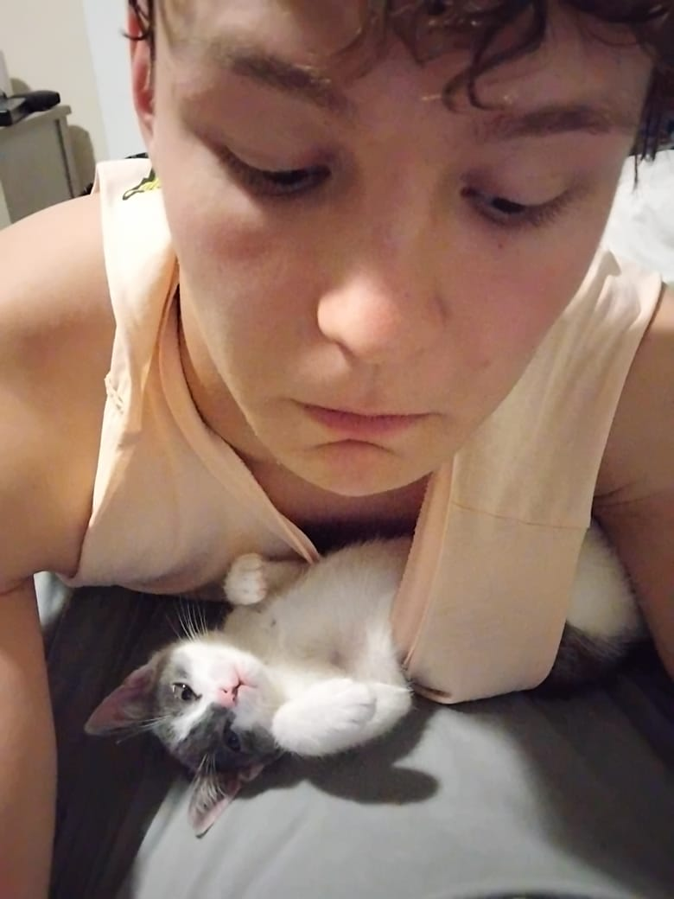

## Team GIT DOXYGEN TO BREATHE

# COS 214 Project - Plant Nursery Simulator

<a href="https://cdn.pixabay.com/animation/2023/04/16/19/38/19-38-30-94_512.gif"></a>

# Contents

- [Description](#description)
- [Documentation and UML diagrams](#documentation)
- [Setup](#setup)
- [Team](#team)

# Description

The Plant Nursery Simulator is a C++ project that models a complete plant nursery ecosystem. Staff can manage plant growth, coordinate inventory activities, and handle customer interactions through a system that implements 10+ design patterns for flexibility, maintainability, and scalability.

The simulation demonstrates object-oriented design excellence through patterns like Factory Method for plant creation, State for plant life cycles, Decorator for customer customizations, and Chain of Responsibility for staff request handling to name a few.

# Documentation

[Report](../Documents/Report.pdf)

[Functional Requirements](../Documents/Functional_Requirements.pdf) 

[Design Pattern Specifications](../Documents/Specifications.pdf)

[Doxygen Documentation](../Documents/Doxygen/)

[UML Diagrams](../UML/)

# Setup

### Prerequisites
```
sudo apt-get install libboost-all-dev

sudo apt-get install doctest-dev
```

### Cloning
```
git clone https://github.com/JoshKretschmer/COS214_Prac_GIT_Doxygen.git
cd COS214_Prac_GIT_Doxygen/SystemFiles/src
```

### Building

This project can be built using the makefile:

- **Compilation**:  
  ```bash
  cd SystemFiles
  make all
  ```

- **Demo Main**:  
  ```bash
  make run_demo
  ```

- **Unit Tests**:  
  ```bash
  make run_tests
  ```

### Running

When the program runs:
1. Browse available plants using the inventory system
2. Select plants and apply customizations (pots, wrapping, arrangements)
3. Staff will handle requests through the command system
4. Complete purchases with undo capability
5. Monitor plant growth and care routines

# Team

<table>
    <tr><th>Member</th><th>Roles</th><th>Description</th></tr>
    <tr>
      <td align="center">
        Ané de Ridder<br>Team Leader<br>
        
      </td>
      <td align="center">
        Project Coordination<br>Documentation<br>System Integration<br>
        <a href="#">
          
        </a>
      </td>
      <td>
        Chief Exception Handler of both code and team drama
      </td>
    </tr>
    <tr>
      <td align="center">
        Bridget Nkosi<br>
        
      </td>
      <td align="center">
        System Implementation<br>Testing<br>
        <a href="https://github.com/nkosibridgett">
          
        </a>
      </td>
      <td>
        Implemented the Observer pattern...mostly to observe others working
      </td>
    </tr>
    <tr>
      <td align="center">
        David Kalu<br>
        
      </td>
      <td align="center">
        System Implementation<br>Testing<br>
        <a href="#">
          
        </a>
      </td>
      <td>
        Said "It's a small, easy fix."
      </td>
      <td>
                  It was not.
      </td>
    </tr>
    <tr>
      <td align="center">
        Joshua Kretschmer<br>
        
      </td>
      <td align="center">
        System Implementation<br>Integration<br>
        <a href="#">
          
        </a>
      </td>
      <td>
        Drops the word "squiz" casually in conversations...still no confirmed definition.
      </td>
    </tr>
    <tr>
      <td align="center">
        Keagan<br>
        
      </td>
      <td align="center">
        UI<br>Integration<br>
        <a href="#">
          
        </a>
      </td>
      <td>
       Commited something legendary. No one knows what it does, but it works.
      </td>
    </tr>
    <tr>
      <td align="center">
        Michelle Njoroge<br>
        
      </td>
      <td align="center">
        UI<br>Testing<br>Documentation<br>
        <a href="#">
          
        </a>
      </td>
      <td>
        Turns a 10 minute task into a 5 hour chore.
      </td>
    </tr>
    <tr>
      <td align="center">
        Ophelia Greyling<br>
        
      </td>
      <td align="center">
        System Implementation<br>Testing<br>Integration<br>
        <a href="#">
          
        </a>
      </td>
      <td>
        Has a PhD in "..just one last commit"
      </td>
    </tr>
</table>

